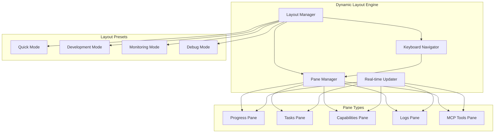

# Dynamic Terminal Layout System - Comprehensive Implementation Plan

## 🎯 **Executive Summary**

This plan transforms Guidant's current static/live/interactive dashboard modes into a unified **Dynamic Terminal Layout System** - a VS Code-inspired multi-pane interface that provides real-time workflow orchestration with keyboard navigation, collapsible panels, and direct MCP tool execution.

**Strategic Alignment**: This enhancement directly supports Guidant's mission as a "systematic workflow orchestrator" by providing professional-grade visual interfaces that hide technical complexity while enabling powerful AI coordination.

---

## 📊 **Current Architecture Assessment**

### **✅ Strong Foundation (Preserve & Build Upon)**
- **React/Ink Components**: Mature component library in `src/ui/ink/components/`
- **Dual-Renderer Architecture**: Proven fallback system (Ink → Legacy)
- **MCP Integration**: 16 working tools with file-based state management
- **File Watchers**: Real-time updates via `.guidant/` directory monitoring
- **Modular Structure**: Clean separation of concerns across renderer types

### **🔄 Areas for Enhancement**
- **Mode Separation**: Current static/live/interactive are separate rather than unified
- **Limited Interactivity**: Basic keyboard navigation without direct tool execution
- **Single-Pane Focus**: No concurrent multi-pane data display
- **Layout Rigidity**: Fixed layouts without dynamic resizing or presets

### **🚨 Critical Preservation Requirements**
- **Backward Compatibility**: Maintain `guidant dashboard` and `guidant live` commands
- **Graceful Fallback**: Ink failures must fall back to legacy renderer
- **MCP Integration**: Preserve existing file watcher → state update → rerender flow
- **Performance**: Maintain <100ms update latency and <100MB memory usage

---

## 🏗️ **Dynamic Layout System Architecture**

### **Core Components**



### **Layout Presets Strategy**

**Quick Mode** (Replaces `guidant dashboard`)
- Single-pane compact view
- Essential project status only
- Fast rendering (<1s)
- Minimal resource usage

**Development Mode** (Replaces `guidant live`)
- 3-pane layout: Progress | Tasks | Capabilities
- Real-time updates with file watchers
- Keyboard navigation between panes
- Direct MCP tool execution

**Monitoring Mode** (Enhanced `guidant live`)
- 4-pane layout: Progress | Tasks | Logs | Tools
- Live MCP tool execution feedback
- Performance metrics display
- Error tracking and recovery

**Debug Mode** (New capability)
- 5-pane layout: All panes visible
- Detailed state inspection
- MCP tool debugging interface
- Session replay capabilities

---

## 📁 **File-by-File Implementation Strategy**

### **Phase 1: Core Layout Engine (Week 1)**

#### **1.1 Create Layout Manager**
**File**: `src/ui/ink/layout/LayoutManager.js`
```javascript
// Core layout orchestration
// - Manage pane arrangements and sizing
// - Handle layout preset switching
// - Coordinate keyboard navigation
// - Manage responsive resizing
```

#### **1.2 Create Pane Manager**
**File**: `src/ui/ink/layout/PaneManager.js`
```javascript
// Individual pane lifecycle management
// - Pane registration and deregistration
// - State synchronization per pane
// - Collapse/expand functionality
// - Content routing and updates
```

#### **1.3 Create Keyboard Navigator**
**File**: `src/ui/ink/layout/KeyboardNavigator.js`
```javascript
// Unified keyboard handling
// - Tab navigation between panes
// - Shortcut key execution (n, p, a, r, h, q)
// - Context-sensitive help system
// - Direct MCP tool triggering
```

#### **1.4 Enhance Real-time Updater**
**File**: `src/ui/ink/layout/RealTimeUpdater.js`
```javascript
// Enhanced file watching and state management
// - Debounced updates (100ms)
// - Selective pane updates
// - Memory management
// - Error recovery
```

### **Phase 2: Pane Components (Week 2)**

#### **2.1 Create Base Pane Component**
**File**: `src/ui/ink/panes/BasePane.js`
```javascript
// Abstract base class for all panes
// - Common pane interface
// - Collapse/expand behavior
// - Border and focus management
// - Update lifecycle hooks
```

#### **2.2 Enhanced Progress Pane**
**File**: `src/ui/ink/panes/ProgressPane.js`
```javascript
// Builds on existing ProgressSection
// - Phase progression visualization
// - Real-time progress updates
// - Collapsible phase details
// - Time tracking display
```

#### **2.3 Enhanced Tasks Pane**
**File**: `src/ui/ink/panes/TasksPane.js`
```javascript
// Builds on existing TasksSection
// - Current and upcoming tasks
// - Dependency visualization
// - Task status updates
// - Direct task execution
```

#### **2.4 Enhanced Capabilities Pane**
**File**: `src/ui/ink/panes/CapabilitiesPane.js`
```javascript
// Builds on existing CapabilitiesSection
// - Tool matrix display
// - Gap analysis visualization
// - Coverage metrics
// - Tool recommendation system
```

#### **2.5 New Logs Pane**
**File**: `src/ui/ink/panes/LogsPane.js`
```javascript
// Real-time logging display
// - MCP tool execution logs
// - Error tracking
// - Session activity
// - Filterable log levels
```

#### **2.6 New MCP Tools Pane**
**File**: `src/ui/ink/panes/MCPToolsPane.js`
```javascript
// Direct MCP tool interface
// - Available tools list
// - Execution status
// - Parameter input
// - Result display
```

### **Phase 3: Integration & Commands (Week 3)**

#### **3.1 Create Dynamic Dashboard Command**
**File**: `src/cli/commands/dynamic-dashboard.js`
```javascript
// New unified dashboard command
// - Layout preset selection
// - Backward compatibility mode
// - Error handling and fallback
// - Performance monitoring
```

#### **3.2 Enhance Existing Commands**
**Files**: 
- `src/cli/commands/dashboard.js` (Add dynamic mode option)
- `src/cli/commands/live.js` (Redirect to dynamic system)

#### **3.3 Create Layout Preset Configurations**
**File**: `src/ui/ink/layout/presets/index.js`
```javascript
// Layout preset definitions
// - Quick, Development, Monitoring, Debug modes
// - Responsive breakpoints
// - Pane size calculations
// - Keyboard shortcut mappings
```

---

## 🔧 **Migration Strategy**

### **Backward Compatibility Approach**

1. **Preserve Existing Commands**
   - `guidant dashboard` → Quick Mode (enhanced static)
   - `guidant live` → Development Mode (enhanced live)
   - Add `guidant dynamic` → Full dynamic system

2. **Graceful Enhancement**
   - Existing components become pane content
   - Current file watchers integrate with new updater
   - MCP tools work unchanged
   - Legacy fallback remains intact

3. **Progressive Rollout**
   - Phase 1: Core engine (no user-facing changes)
   - Phase 2: Enhanced panes (improved existing commands)
   - Phase 3: New dynamic command (additional capability)

### **Risk Mitigation**

**Risk**: Breaking existing dashboard functionality
**Mitigation**: Maintain separate command paths until dynamic system is proven

**Risk**: Performance degradation with multiple panes
**Mitigation**: Implement lazy loading and selective updates

**Risk**: Keyboard conflicts with terminal
**Mitigation**: Comprehensive key mapping and escape sequences

**Risk**: MCP integration failures
**Mitigation**: Robust error handling and fallback mechanisms

---

## 🧪 **Testing Strategy**

### **Unit Tests**
- `tests/ui/layout/LayoutManager.test.js`
- `tests/ui/layout/PaneManager.test.js`
- `tests/ui/layout/KeyboardNavigator.test.js`
- `tests/ui/panes/BasePane.test.js`

### **Integration Tests**
- `tests/dashboard-dynamic.test.js` (Full system integration)
- `tests/mcp-integration.test.js` (MCP tool execution)
- `tests/performance.test.js` (Memory and latency benchmarks)

### **User Acceptance Tests**
- All keyboard shortcuts functional
- Layout presets switch correctly
- Real-time updates work reliably
- Fallback system activates on failures

---

## 📈 **Success Metrics**

### **Performance Targets**
- **Update Latency**: <100ms for file watcher → UI update
- **Memory Usage**: <100MB for full dynamic dashboard
- **Startup Time**: <2s for dynamic mode initialization
- **Keyboard Response**: <50ms for key press → action

### **Functionality Targets**
- **MCP Tool Success Rate**: >95% execution success
- **Layout Switching**: <500ms between preset changes
- **Pane Operations**: Collapse/expand <200ms
- **Error Recovery**: Automatic fallback <1s

### **User Experience Targets**
- **Learning Curve**: <5 minutes to master navigation
- **Workflow Efficiency**: >30% improvement in task management
- **Visual Clarity**: Clear information hierarchy
- **Professional Appearance**: Enterprise-quality interface

---

## 🚀 **Implementation Timeline**

### **Week 1: Foundation**
- [ ] Create Layout Manager core
- [ ] Implement Pane Manager base
- [ ] Build Keyboard Navigator
- [ ] Enhance Real-time Updater

### **Week 2: Panes**
- [ ] Create BasePane component
- [ ] Enhance existing pane components
- [ ] Build new Logs and MCP Tools panes
- [ ] Implement collapse/expand functionality

### **Week 3: Integration**
- [ ] Create dynamic dashboard command
- [ ] Implement layout presets
- [ ] Add backward compatibility
- [ ] Complete testing suite

### **Week 4: Polish & Documentation**
- [ ] Performance optimization
- [ ] Error handling enhancement
- [ ] User documentation
- [ ] Implementation logging

---

---

## 🔍 **Technical Specifications**

### **Layout Manager Architecture**

```javascript
// Layout Manager Core Interface
class LayoutManager {
  constructor(terminalDimensions, preset = 'development') {
    this.dimensions = terminalDimensions;
    this.currentPreset = preset;
    this.panes = new Map();
    this.focusedPane = null;
    this.keyboardNavigator = new KeyboardNavigator(this);
  }

  // Core layout operations
  setPreset(presetName) { /* Switch between Quick/Development/Monitoring/Debug */ }
  addPane(paneId, component, config) { /* Register new pane */ }
  removePane(paneId) { /* Unregister pane */ }
  focusPane(paneId) { /* Set keyboard focus */ }
  resizePane(paneId, dimensions) { /* Dynamic resizing */ }

  // Layout calculations
  calculatePaneLayout() { /* Responsive grid calculations */ }
  handleTerminalResize() { /* Responsive breakpoints */ }
  optimizeForTerminalSize() { /* Adaptive layout selection */ }
}
```

### **Pane Manager Interface**

```javascript
// Base Pane Component
class BasePane extends React.Component {
  constructor(props) {
    super(props);
    this.state = {
      collapsed: false,
      focused: false,
      lastUpdate: null,
      data: null
    };
  }

  // Lifecycle methods
  onMount() { /* Pane initialization */ }
  onUnmount() { /* Cleanup resources */ }
  onFocus() { /* Handle focus events */ }
  onBlur() { /* Handle blur events */ }
  onUpdate(newData) { /* Handle data updates */ }
  onCollapse() { /* Handle collapse/expand */ }

  // Keyboard handling
  handleKeyPress(key) { /* Pane-specific shortcuts */ }
  getKeyboardHelp() { /* Context-sensitive help */ }
}
```

### **MCP Integration Points**

```javascript
// Real-time MCP Tool Integration
const mcpIntegrationMap = {
  // Progress Pane Updates
  'guidant_report_progress': {
    targetPane: 'progress',
    updateType: 'phase_advancement',
    refreshTrigger: '.guidant/workflow/current-phase.json'
  },

  // Tasks Pane Updates
  'guidant_get_current_task': {
    targetPane: 'tasks',
    updateType: 'task_generation',
    refreshTrigger: '.guidant/ai/task-tickets/'
  },

  // Capabilities Pane Updates
  'guidant_discover_agent': {
    targetPane: 'capabilities',
    updateType: 'capability_analysis',
    refreshTrigger: '.guidant/ai/capabilities.json'
  },

  // Logs Pane Updates
  'all_mcp_tools': {
    targetPane: 'logs',
    updateType: 'execution_log',
    refreshTrigger: '.guidant/context/sessions.json'
  }
};
```

---

## ⚠️ **Risk Assessment & Mitigation**

### **High-Risk Areas**

#### **1. Performance Degradation**
**Risk Level**: HIGH
**Impact**: Multiple panes could cause memory leaks and slow rendering
**Mitigation Strategy**:
- Implement virtual scrolling for large data sets
- Use React.memo for expensive components
- Debounce file watcher updates (100ms)
- Lazy load pane content until focused
- Memory cleanup on pane unmount

#### **2. Keyboard Conflict Issues**
**Risk Level**: MEDIUM
**Impact**: Terminal shortcuts could conflict with pane navigation
**Mitigation Strategy**:
- Comprehensive key mapping documentation
- Escape sequence handling for special keys
- Context-aware keyboard routing
- User-configurable key bindings
- Clear visual feedback for key states

#### **3. MCP Tool Integration Failures**
**Risk Level**: MEDIUM
**Impact**: Real-time updates could break or become inconsistent
**Mitigation Strategy**:
- Robust error handling with retry logic
- Graceful degradation to manual refresh
- MCP tool health monitoring
- Fallback to legacy dashboard on failures
- Comprehensive logging for debugging

### **Medium-Risk Areas**

#### **4. Layout Responsiveness**
**Risk Level**: MEDIUM
**Impact**: Poor layout on different terminal sizes
**Mitigation Strategy**:
- Responsive breakpoints (80, 120, 160 columns)
- Adaptive pane collapsing on small screens
- Minimum terminal size requirements
- Graceful layout degradation
- User preference persistence

#### **5. Backward Compatibility**
**Risk Level**: MEDIUM
**Impact**: Breaking existing user workflows
**Mitigation Strategy**:
- Maintain all existing command signatures
- Preserve legacy renderer as fallback
- Gradual feature rollout
- User migration guides
- Version detection and compatibility modes

### **Low-Risk Areas**

#### **6. File System Watching**
**Risk Level**: LOW
**Impact**: File watcher failures or resource exhaustion
**Mitigation Strategy**:
- Use proven chokidar library
- Implement watcher health checks
- Resource cleanup on dashboard exit
- Configurable watch intervals
- Manual refresh fallback

---

## 🎨 **User Experience Design**

### **Layout Preset Specifications**

#### **Quick Mode (80+ columns)**
```
┌─ Guidant Project Status ─────────────────────────────────────┐
│ Project: MyApp • Phase: Implementation • Progress: 75%      │
│ Current Task: Implement Dynamic Layout System               │
│ Tools: 16 available • Coverage: 85% • Next: guidant next   │
└─────────────────────────────────────────────────────────────┘
```

#### **Development Mode (120+ columns)**
```
┌─ Progress ─────────────┐ ┌─ Current Task ────────────┐ ┌─ Capabilities ─┐
│ Phase: Implementation  │ │ Dynamic Layout System     │ │ Tools: 16      │
│ ████████░░ 75%        │ │ Priority: High            │ │ Coverage: 85%  │
│ 3/4 phases complete   │ │ Status: In Progress       │ │ Gaps: 2 tools  │
│                       │ │ Subtasks: 4/6 done       │ │ [n] Next task  │
└───────────────────────┘ └───────────────────────────┘ └────────────────┘
```

#### **Monitoring Mode (160+ columns)**
```
┌─ Progress ──────┐ ┌─ Tasks ─────────┐ ┌─ Logs ──────────┐ ┌─ MCP Tools ─┐
│ Phase: Impl     │ │ Current: Layout │ │ 14:32 Started   │ │ [n] Next    │
│ ██████░░ 75%   │ │ Next: Testing   │ │ 14:33 Progress  │ │ [p] Progress│
│ 3/4 complete   │ │ Blocked: 0      │ │ 14:34 Success   │ │ [a] Advance │
└────────────────┘ └─────────────────┘ └─────────────────┘ └─────────────┘
```

### **Keyboard Navigation Flow**

```
Tab → Focus next pane
Shift+Tab → Focus previous pane
↑/↓ → Navigate within pane
←/→ → Navigate pane items
Enter → Execute/Expand
Space → Toggle collapse
h → Show help overlay
q → Quit dashboard
Ctrl+C → Force exit

Pane-specific shortcuts:
n → Generate next task (Tasks pane)
p → Report progress (Progress pane)
a → Advance phase (Progress pane)
r → Refresh all data
c → Toggle compact mode
f → Toggle fullscreen pane
```

---

## 📚 **Legacy Pattern Integration**

### **Proven UI Patterns from TaskMaster**

Based on analysis of `legacy-context/scripts/modules/ui.js` (2,098 lines), we should preserve these successful patterns:

#### **1. Terminal Width Adaptation**
```javascript
// From legacy-context/scripts/modules/ui.js:1651-1660
const getTerminalWidth = () => process.stdout.columns || 100;
const calculateColumnWidths = (terminalWidth) => {
  const idWidth = 12;
  const titleWidth = Math.floor(terminalWidth * 0.25);
  const commandWidth = terminalWidth - idWidth - titleWidth - 10;
  return { idWidth, titleWidth, commandWidth };
};
```

#### **2. Boxen Configuration Standards**
```javascript
// Proven boxen patterns for consistent appearance
const getBoxenConfig = (type) => ({
  padding: { top: 0, bottom: 0, left: 1, right: 1 },
  borderColor: type === 'error' ? 'red' : type === 'success' ? 'green' : 'blue',
  borderStyle: 'round',
  margin: { top: 1, bottom: 0 }
});
```

#### **3. Progress Bar Visualization**
```javascript
// Enhanced progress bars with color coding
const createProgressBar = (percent, length = 30) => {
  const filled = Math.round((percent * length) / 100);
  const color = percent >= 75 ? 'green' : percent >= 50 ? 'yellow' : 'red';
  return `${chalk[color]('█'.repeat(filled))}${chalk.gray('░'.repeat(length - filled))} ${percent}%`;
};
```

#### **4. Status Color Coding**
```javascript
// Consistent status visualization
const getStatusWithColor = (status) => {
  const colors = {
    completed: 'green',
    'in-progress': 'yellow',
    pending: 'gray',
    blocked: 'red',
    error: 'red'
  };
  return chalk[colors[status] || 'white'](status);
};
```

---

## 🔄 **MCP Tool Integration Mapping**

### **16 MCP Tools → Pane Integration**

```javascript
const mcpToolPaneMapping = {
  // Core Project Management → Progress Pane
  'guidant_init_project': { pane: 'progress', trigger: 'project_creation' },
  'guidant_get_project_state': { pane: 'progress', trigger: 'state_refresh' },
  'guidant_save_deliverable': { pane: 'progress', trigger: 'deliverable_save' },

  // Workflow Control → Tasks Pane
  'guidant_get_current_task': { pane: 'tasks', trigger: 'task_generation' },
  'guidant_report_progress': { pane: 'tasks', trigger: 'progress_update' },
  'guidant_advance_phase': { pane: 'progress', trigger: 'phase_advancement' },

  // Agent Discovery → Capabilities Pane
  'guidant_discover_agent': { pane: 'capabilities', trigger: 'agent_analysis' },
  'guidant_list_agents': { pane: 'capabilities', trigger: 'agent_registry' },

  // Capability Analysis → Capabilities Pane
  'guidant_analyze_gaps': { pane: 'capabilities', trigger: 'gap_analysis' },
  'guidant_request_tools': { pane: 'capabilities', trigger: 'tool_request' },
  'guidant_suggest_config': { pane: 'capabilities', trigger: 'config_suggestion' },

  // Adaptive Workflow → All Panes
  'guidant_classify_project': { pane: 'all', trigger: 'project_classification' },
  'guidant_generate_adaptive_workflow': { pane: 'progress', trigger: 'workflow_generation' },
  'guidant_apply_adaptive_workflow': { pane: 'progress', trigger: 'workflow_application' },
  'guidant_get_workflow_modes': { pane: 'progress', trigger: 'mode_discovery' },
  'guidant_suggest_workflow_upgrade': { pane: 'progress', trigger: 'upgrade_suggestion' }
};
```

### **Real-time Update Triggers**

```javascript
const fileWatcherMapping = {
  // Progress Pane Updates
  '.guidant/workflow/current-phase.json': ['progress'],
  '.guidant/workflow/phases/': ['progress'],

  // Tasks Pane Updates
  '.guidant/ai/task-tickets/': ['tasks'],
  '.guidant/context/current-task.json': ['tasks'],

  // Capabilities Pane Updates
  '.guidant/ai/capabilities.json': ['capabilities'],
  '.guidant/ai/agents/': ['capabilities'],

  // Logs Pane Updates (All MCP activity)
  '.guidant/context/sessions.json': ['logs'],
  '.guidant/context/decisions.json': ['logs'],

  // Global Updates (All panes)
  '.guidant/project/config.json': ['all']
};
```

---

**Next Steps**: Begin Phase 1 implementation with Layout Manager creation and core architecture setup.
