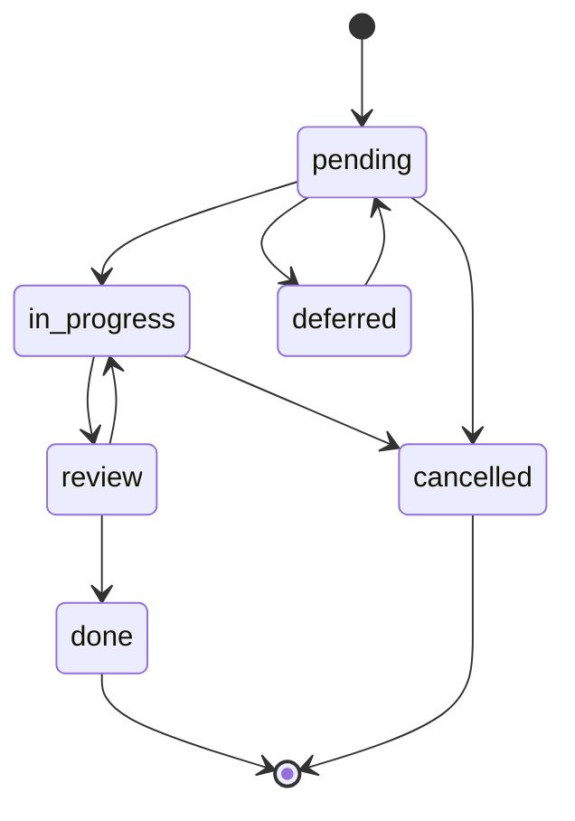

# TaskMaster Legacy Analysis - Key Learnings

> **Analysis of from-taskmaster-main and design.md to extract valuable patterns for our new systematic approach**

---

## 🎯 **CORE ARCHITECTURAL INSIGHTS**

### **What They Got Right**

1. **Dual Interface Pattern** - Both MCP and CLI work with shared core logic
2. **File-Based Storage** - JSON files in organized directory structure (no database dependency)
3. **Direct Function Pattern** - Clean separation between interface and business logic
4. **Tool Registration System** - Consistent pattern for adding new MCP tools

### **Strong Foundation Elements to Keep**

- **Path Resolution Abstraction** - Consistent file system handling
- **Error Handling Patterns** - `{ success, error, message }` return objects
- **Zod Validation** - Runtime type checking for MCP tools
- **AI Provider Abstraction** - Multi-provider support with standardized interface

---

## 🎨 **VISUAL DASHBOARD EXCELLENCE** 

### **Console UI Masterclass**

The legacy system has **world-class terminal UI** that we should absolutely learn from:

#### **Progress Visualization**
```javascript
// Multi-colored progress bars with status breakdowns
function createProgressBar(percent, length = 30, statusBreakdown = null) {
  // Green gradient based on completion: red → orange → yellow → green → dark green
  // Different unicode characters: █ for completed, ░ for remaining
  // Color-coded sections: in-progress (orange), pending (yellow), blocked (red)
}
```

#### **Status System with Visual Excellence**
- **6 Status States**: done, pending, in-progress, review, deferred, cancelled
- **Dual Icon System**: Full emojis for console, ASCII for tables
- **Color Psychology**: Green (done), Yellow (pending), Orange (in-progress), Red (blocked)

#### **Responsive Dashboard Layout**
```javascript
// Side-by-side dashboards that stack vertically on narrow terminals
const terminalWidth = process.stdout.columns || 80;
if (terminalWidth >= totalMinWidth) {
  // Show boxes side by side with responsive widths
} else {
  // Stack vertically for narrow terminals
}
```

### **Table Excellence with cli-table3**
- **Dynamic Column Widths**: Percentage-based calculations that adapt to terminal size
- **Word Wrapping**: Intelligent text truncation with ellipsis
- **Color-Coded Cells**: Status indicators, dependency states, complexity scores
- **Borderless Design**: Clean, modern appearance

### **Visual Hierarchy Patterns**
- **Boxed Content** using `boxen` for important information
- **Gradient Text** using `gradient-string` for branding
- **Interactive Spinners** using `ora` for loading states
- **Chalk Color System** with consistent color meanings

---

## 🧠 **LOGIC PATTERNS WORTH LEARNING**

### **Task Status Workflow**


**Key Insight**: The `review` status is brilliant - it creates a quality gate before marking tasks complete.

### **Dependency Management Sophistication**
- **Visual Dependency Status**: Color-coded dependency indicators (green=done, red=incomplete)
- **Subtask Relationships**: Support for `parentId.subtaskId` notation (e.g., "22.1")
- **Circular Dependency Detection**: Built-in validation to prevent cycles
- **Ready-to-Work Calculation**: Automatic identification of tasks with satisfied dependencies

### **Complexity Analysis System**
```javascript
// 1-10 complexity scoring with visual indicators
function getComplexityWithColor(score) {
  if (score <= 3) return chalk.green(`🟢 ${score}`);  // Simple
  if (score <= 6) return chalk.yellow(`🟡 ${score}`); // Medium
  return chalk.red(`🔴 ${score}`);                     // Complex
}
```

### **AI Provider Architecture**
```javascript
class BaseProvider {
  async generateText(prompt, options) {
    // Standardized interface across all providers
    // Built-in fallback handling
    // Cost optimization through provider switching
  }
}
```

**Providers Supported**: Anthropic, OpenAI, Google, Perplexity, xAI, OpenRouter, Ollama

---

## 📊 **BUSINESS LOGIC INSIGHTS**

### **"Next Task" Intelligence**
The `findNextTask` function is sophisticated:
- Considers dependency satisfaction
- Weighs priority levels
- Factors in complexity scores
- Handles both tasks and subtasks
- Returns the optimal next work item

### **Project Lifecycle Management**
- **Initialization**: Structured `.taskmaster/` directory creation
- **PRD Parsing**: AI-driven task generation from requirements
- **Task Expansion**: Breaking down complex tasks into subtasks
- **Progress Tracking**: Real-time completion statistics

### **Multi-Modal Task Support**
- **Parent Tasks**: High-level objectives
- **Subtasks**: Detailed implementation steps  
- **Dependencies**: Both task-to-task and subtask-to-subtask
- **Status Inheritance**: Smart status propagation rules

---

## 🚀 **WHAT TO ADOPT IN NEW APPROACH**

### **Immediate Wins**
1. **Console Dashboard Design** - Copy the entire visual system
2. **Progress Bar Implementation** - Multi-colored status breakdowns
3. **Status Workflow** - Especially the `review` status for quality gates
4. **Table Layouts** - Responsive column width calculations

### **Core Logic Patterns**
1. **Direct Function Pattern** - Clean interface/logic separation
2. **AI Provider Abstraction** - Multi-provider support with fallbacks
3. **Path Resolution System** - Consistent file system handling
4. **Error Handling** - Structured success/error responses

### **File Management**
1. **Directory Structure** - Organized `.taskmaster/` layout
2. **JSON Storage** - Human-readable, Git-friendly data format
3. **Report Generation** - Complexity analysis and progress tracking
4. **File Templates** - Automated project initialization

---

## ⚠️ **WHAT TO AVOID**

### **Complexity Overload**
- Too many AI providers (focus on 2-3 core ones)
- Complex subtask dependency chains (keep it simple)
- Feature creep in CLI commands (focus on core workflows)

### **UI Pitfalls**
- Over-reliance on Unicode characters (breaks in some terminals)
- Fixed-width layouts (always calculate dynamic widths)
- Too much color (use sparingly for maximum impact)

### **Architecture Issues**
- Tight coupling between CLI and MCP interfaces
- Monolithic command handlers (break into focused functions)
- Missing validation at system boundaries

---

## 🎯 **SPECIFIC IMPLEMENTATIONS TO COPY**

### **1. Visual Dashboard System**
```javascript
// Copy entire ui.js patterns:
- createProgressBar() with multi-color status breakdowns
- getStatusWithColor() with dual icon system
- formatDependenciesWithStatus() with color coding
- Responsive boxen layouts for side-by-side dashboards
```

### **2. Task Status Management**
```javascript
// Implement review status workflow:
pending → in-progress → review → done
// With quality gates preventing advancement without validation
```

### **3. Terminal Responsiveness**
```javascript
// Dynamic width calculations:
const terminalWidth = process.stdout.columns || 80;
const columnWidths = calculateDynamicWidths(terminalWidth);
```

### **4. AI Provider System**
```javascript
// Multi-provider support with intelligent routing:
mainModel: "claude-3-5-sonnet" (primary reasoning)
researchModel: "sonar-pro" (web search & research)  
fallbackModel: "gpt-4o" (backup option)
```

---

## 💡 **NEW APPROACH INTEGRATION**

### **How Legacy Learnings Fit Our Vision**

1. **Systematic Workflows** - Use the visual dashboard to show phase progression
2. **Context Preservation** - Leverage the file system patterns for persistent memory
3. **Business Decision Translation** - Use the clean UI patterns to hide technical complexity
4. **Quality Gates** - Implement the `review` status for validation requirements

### **Enhanced Implementation Ideas**

1. **Phase-Based Dashboards** - Adapt the visual system to show SDLC phase progress
2. **AI Agent Coordination** - Use the provider system for role-specific AI agents
3. **Research Enforcement** - Build on the complexity analysis for systematic research
4. **Progress Visualization** - Show business-friendly progress using the dashboard patterns

---

## 🔧 **IMMEDIATE ACTION ITEMS**

### **Phase 1: Visual System Integration**
1. Copy `ui.js` patterns for console dashboards
2. Implement responsive table layouts with `cli-table3`
3. Add multi-colored progress bars for phase tracking
4. Create boxed layouts for business decision presentation

### **Phase 2: Logic Pattern Adoption**
1. Implement the direct function pattern for MCP tools
2. Add the review status workflow for quality gates
3. Create AI provider abstraction for research enforcement
4. Build dependency management with visual status indicators

### **Phase 3: Business Experience Enhancement**
1. Adapt dashboard layouts for business users
2. Create phase-based progress visualization
3. Implement decision templates using boxed layouts
4. Add systematic workflow tracking with visual feedback

---

**Key Takeaway**: The legacy TaskMaster has world-class terminal UI and solid architectural patterns. Our new systematic approach should absolutely leverage these visual and logical foundations while adding our focus on AI agent orchestration and business decision translation.

---

**Last Updated**: December 2024  
**Source Analysis**: from-taskmaster-main + design.md  
**Next Step**: Integrate visual patterns into Phase 1 development
