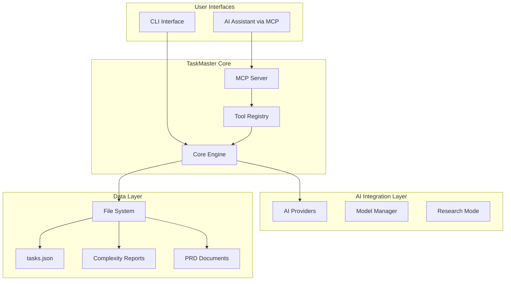
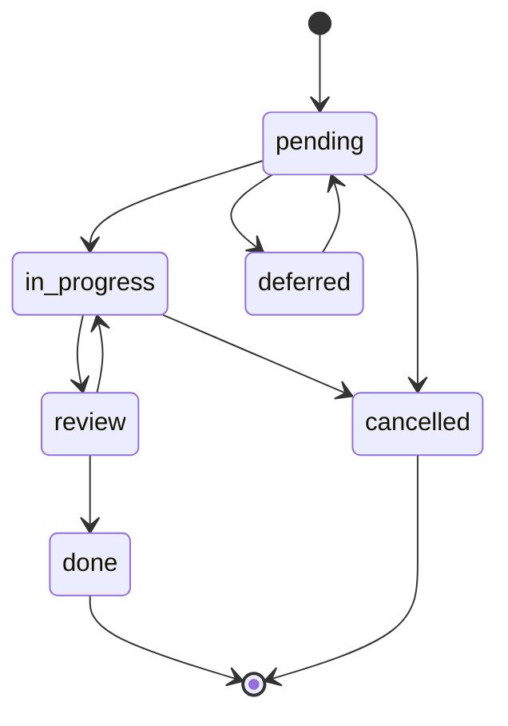
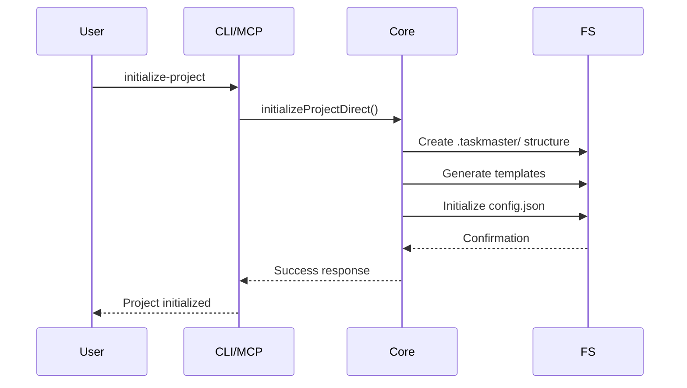
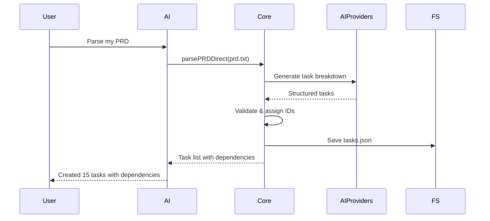
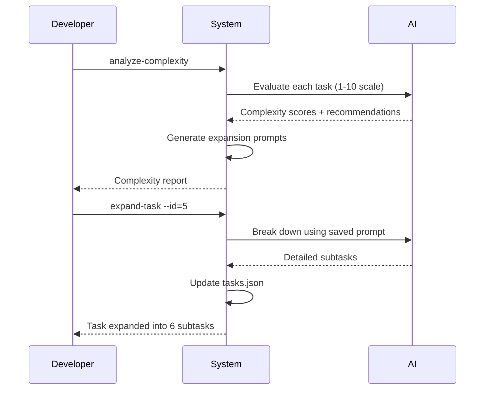
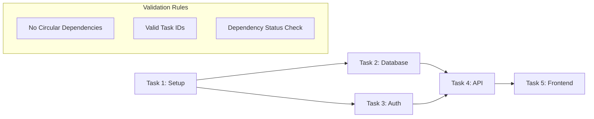

# TaskMaster AI - System Architecture & Design

*An AI-powered task management framework for intelligent development workflow orchestration*

---

## 📊 System Overview

TaskMaster AI is a sophisticated task management framework designed to enhance AI-driven development workflows. It provides both programmatic (MCP) and command-line interfaces for systematic project organization, task breakdown, and progress tracking.

### Core Philosophy
- **AI-First Design**: Built specifically for AI assistants and AI-driven development
- **Systematic Workflow**: Enforces structured development processes
- **Dual Interface**: MCP for AI integration + CLI for direct control
- **Context Preservation**: Maintains project state and decision history

---

## 🏗️ High-Level Architecture



---

## 🔧 Core Components

### 1. **MCP Server** (`mcp-server/`)
**Purpose**: Provides programmatic access for AI assistants

**Key Files**:
- `server.js` - Main MCP server entry point
- `src/index.js` - TaskMaster MCP server class
- `src/tools/` - Individual MCP tool implementations

**Architecture**:
```javascript
class TaskMasterMCPServer {
  - FastMCP server instance
  - Tool registration system
  - Environment configuration
  - Graceful shutdown handling
}
```

**Tool Categories**:
1. **Project Setup**: `initialize-project`, `models`, `parse-prd`
2. **Task Management**: `get-tasks`, `add-task`, `update-task`, `set-task-status`
3. **Analysis**: `analyze`, `complexity-report`, `next-task`
4. **Dependencies**: `add-dependency`, `remove-dependency`, `validate-dependencies`
5. **Expansion**: `expand-task`, `expand-all`

### 2. **Core Engine** (`mcp-server/src/core/`)
**Purpose**: Central business logic and data processing

**Key Components**:
- `task-master-core.js` - Central function registry
- `direct-functions/` - Core implementation functions
- `utils/` - Path resolution and utility functions
- `context-manager.js` - Project context management

**Direct Functions Pattern**:
```javascript
// Each tool has a corresponding direct function
export const directFunctions = new Map([
  ['listTasksDirect', listTasksDirect],
  ['parsePRDDirect', parsePRDDirect],
  // ... all core functions
]);
```

### 3. **CLI Interface** (`bin/`, `scripts/`)
**Purpose**: Direct command-line access and project management

**Architecture**:
```
bin/task-master.js (Entry Point)
└── scripts/dev.js (CLI Router)
    └── scripts/modules/
        ├── commands.js (Command Registration)
        ├── ui.js (User Interface)
        └── utils.js (CLI Utilities)
```

**Command Flow**:
1. `task-master <command>` → CLI wrapper
2. Arguments processed and validated
3. Routed to appropriate direct function
4. Results formatted and displayed

### 4. **AI Integration** (`src/ai-providers/`)
**Purpose**: Multi-provider AI model support

**Supported Providers**:
- Anthropic (Claude)
- OpenAI (GPT models)
- Google (Gemini)
- Perplexity (Research mode)
- xAI (Grok)
- OpenRouter (Multiple models)
- Ollama (Local models)

**Model Configuration**:
```javascript
{
  mainModel: "claude-3-5-sonnet-20241022",
  researchModel: "sonar-pro",
  fallbackModel: "gpt-4o"
}
```

---

## 📊 Data Model & Schema

### Task Structure
```javascript
{
  "id": 1,
  "title": "Initialize Repository",
  "description": "Set up project structure and configuration",
  "status": "pending", // pending|done|in-progress|review|deferred|cancelled
  "priority": "high",  // high|medium|low
  "dependencies": [2, 3], // Array of task IDs
  "details": "Detailed implementation instructions...",
  "testStrategy": "How to verify completion...",
  "subtasks": [
    {
      "id": 1,
      "title": "Create directory structure",
      "status": "pending",
      "details": "..."
    }
  ]
}
```

### Project Structure
```
project-root/
├── .taskmaster/
│   ├── tasks/
│   │   ├── tasks.json          # Main task database
│   │   ├── task-001.md         # Individual task files
│   │   └── task-002.md
│   ├── reports/
│   │   ├── complexity-report.json
│   │   └── analysis-history.json
│   ├── docs/
│   │   ├── prd.txt            # Product Requirements
│   │   └── project-notes.md
│   └── config.json            # Project configuration
```

### Status Workflow


---

## 🔄 Core Workflows

### 1. **Project Initialization**


### 2. **PRD to Tasks Conversion**


### 3. **Task Expansion & Analysis**


### 4. **Dependency Management**


---

## 🛠️ Key Abstractions

### 1. **Tool Pattern**
Every operation follows a consistent pattern:
```javascript
export function registerToolName(server) {
  server.addTool({
    name: 'tool_name',
    description: 'What this tool does',
    parameters: zodSchema,
    execute: withNormalizedProjectRoot(async (args, {log, session}) => {
      // 1. Validate arguments
      // 2. Call direct function
      // 3. Handle result
      // 4. Return response
    })
  });
}
```

### 2. **Direct Function Pattern**
Core business logic separated from interface concerns:
```javascript
export async function operationDirect(args, log) {
  try {
    // 1. Load/validate data
    // 2. Perform operation
    // 3. Save results
    // 4. Return success/error
    return { success: true, data: result };
  } catch (error) {
    return { success: false, error: error.message };
  }
}
```

### 3. **Path Resolution**
Consistent file system abstraction:
```javascript
export function resolveTasksPath(args, log) {
  // 1. Check explicit file parameter
  // 2. Look for .taskmaster/tasks/tasks.json
  // 3. Fallback to scripts/tasks.json
  // 4. Return absolute path or throw error
}
```

### 4. **AI Provider Abstraction**
Model-agnostic AI integration:
```javascript
class AIProvider {
  async generateText(prompt, options) {
    // Provider-specific implementation
    // Returns standardized response format
  }
}
```

---

## 🔌 Integration Points

### 1. **Editor Integration**
TaskMaster integrates with AI-enabled editors through MCP:

**Cursor**:
```json
{
  "mcpServers": {
    "taskmaster-ai": {
      "command": "npx",
      "args": ["-y", "--package=task-master-ai", "task-master-ai"],
      "env": { "ANTHROPIC_API_KEY": "..." }
    }
  }
}
```

**Windsurf, VS Code**: Similar MCP configuration patterns

### 2. **AI Model Integration**
Multiple providers supported with intelligent routing:
```javascript
const modelConfig = {
  main: "claude-3-5-sonnet-20241022",    // Primary reasoning
  research: "sonar-pro",                  // Web search & research
  fallback: "gpt-4o"                     // Backup option
};
```

### 3. **File System Integration**
- **Tasks**: JSON-based storage with markdown export
- **Reports**: Generated analysis and complexity data
- **Configuration**: Project-specific settings
- **Documentation**: PRDs and project notes

---

## 🎯 Quality Assurance

### Testing Strategy
```
tests/
├── unit/              # Core function tests
├── integration/       # MCP tool tests
├── e2e/              # Full workflow tests
└── fixtures/         # Test data
```

### Code Quality
- **Biome**: Formatting and linting
- **ESM Modules**: Modern JavaScript architecture
- **Zod Validation**: Runtime type checking
- **Error Handling**: Comprehensive error management

### Performance Considerations
- **Lazy Loading**: Tools loaded on demand
- **Caching**: Complexity reports cached
- **File Streaming**: Large file handling
- **Memory Management**: Clean resource handling

---

## 🚀 Deployment & Distribution

### Package Distribution
```json
{
  "name": "task-master-ai",
  "bin": {
    "task-master": "bin/task-master.js",
    "task-master-ai": "mcp-server/server.js"
  },
  "type": "module"
}
```

### Installation Options
1. **Global CLI**: `npm install -g task-master-ai`
2. **MCP Server**: `npx task-master-ai` (auto-installed)
3. **Local Development**: Clone and link

### Environment Requirements
- **Node.js**: >=18.0.0
- **API Keys**: At least one AI provider
- **Editors**: MCP-compatible (Cursor, Windsurf, VS Code)

---

## 🔮 Extension Points

### 1. **Custom Tools**
```javascript
export function registerCustomTool(server) {
  server.addTool({
    name: 'custom_operation',
    // Implementation
  });
}
```

### 2. **AI Provider Extensions**
```javascript
class CustomAIProvider extends BaseProvider {
  async generateText(prompt, options) {
    // Custom implementation
  }
}
```

### 3. **Report Generators**
```javascript
export function generateCustomReport(tasks, options) {
  // Custom analysis logic
  return report;
}
```

### 4. **Workflow Hooks**
```javascript
// Pre/post operation hooks
export const hooks = {
  beforeTaskUpdate: (task) => { /* validation */ },
  afterTaskComplete: (task) => { /* notifications */ }
};
```

---

## 📈 Scalability Considerations

### Performance Optimization
- **Incremental Loading**: Large task lists handled efficiently
- **Batch Operations**: Multiple tasks processed together
- **Cache Strategy**: Complexity reports and analysis cached
- **Stream Processing**: Large file operations

### Multi-Project Support
- **Project Isolation**: Each project maintains separate state
- **Workspace Management**: Multiple projects in single workspace
- **Cross-Project Dependencies**: Shared components tracked

### Team Collaboration
- **Version Control**: All data stored in Git-friendly formats
- **Merge Handling**: Conflict resolution for concurrent edits
- **Access Control**: Future extension point for permissions

---

## 💡 Design Decisions & Trade-offs

### File-Based Storage vs Database
**Decision**: JSON files in `.taskmaster/` directory  
**Rationale**: 
- Git-friendly version control
- No external dependencies
- Human-readable and editable
- Simple deployment model

### MCP vs REST API
**Decision**: MCP (Model Context Protocol) for AI integration  
**Rationale**:
- Direct integration with AI editors
- Simplified authentication model
- Local execution (no network latency)
- Better context preservation

### Dual Interface (MCP + CLI)
**Decision**: Maintain both MCP and CLI interfaces  
**Rationale**:
- MCP: Optimized for AI assistant interaction
- CLI: Direct developer access and scripting
- Shared core logic prevents duplication

### AI Model Abstraction
**Decision**: Multi-provider support with intelligent routing  
**Rationale**:
- Vendor independence
- Cost optimization
- Fallback reliability
- Feature specialization (research vs reasoning)

---

This architecture provides a robust foundation for AI-enhanced project management while maintaining flexibility for future enhancements and integrations.
