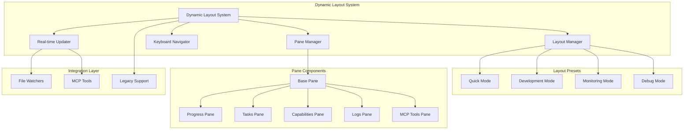

# Dynamic Terminal Layout System - Architecture Documentation

## 🏗️ **System Architecture Overview**

The Dynamic Terminal Layout System transforms Guidant's dashboard from separate static/live/interactive modes into a unified multi-pane interface that provides real-time workflow orchestration with VS Code-inspired panel management.

---

## 🔄 **Core Architecture Principles**

### **1. Unified Layout Engine**
- **Single Entry Point**: All dashboard modes route through the dynamic layout system
- **Preset-Based Configuration**: Quick/Development/Monitoring/Debug modes replace mode separation
- **Responsive Design**: Adaptive layouts based on terminal dimensions
- **Backward Compatibility**: Existing commands work unchanged with enhanced functionality

### **2. Component Composition**
- **Layout Manager**: Orchestrates pane arrangement and keyboard navigation
- **Pane Manager**: Handles individual pane lifecycle and state synchronization
- **Base Pane**: Abstract component providing common pane functionality
- **Specialized Panes**: Progress, Tasks, Capabilities, Logs, MCP Tools

### **3. Real-time Integration**
- **File System Watchers**: Monitor `.guidant/` directory for state changes
- **MCP Tool Integration**: Direct tool execution with immediate UI feedback
- **Debounced Updates**: Efficient rendering with 100ms update batching
- **Selective Refresh**: Only update panes affected by specific changes

---

## 📊 **Component Hierarchy**



---

## 🔧 **Layout Manager Specification**

### **Core Responsibilities**
- **Preset Management**: Switch between layout configurations
- **Pane Orchestration**: Coordinate pane registration and lifecycle
- **Responsive Calculations**: Adapt layouts to terminal dimensions
- **Focus Management**: Handle keyboard navigation between panes

### **Layout Calculation Algorithm**
```javascript
class LayoutManager {
  calculateLayout(preset, terminalDimensions) {
    const { width, height } = terminalDimensions;
    
    // Responsive breakpoints
    if (width < 80) return this.getMinimalLayout();
    if (width < 120) return this.getCompactLayout(preset);
    if (width < 160) return this.getStandardLayout(preset);
    return this.getFullLayout(preset);
  }
  
  getLayoutConfig(preset) {
    const configs = {
      quick: { panes: ['progress'], layout: 'single' },
      development: { panes: ['progress', 'tasks', 'capabilities'], layout: 'triple' },
      monitoring: { panes: ['progress', 'tasks', 'logs', 'tools'], layout: 'quad' },
      debug: { panes: ['progress', 'tasks', 'capabilities', 'logs', 'tools'], layout: 'full' }
    };
    return configs[preset] || configs.development;
  }
}
```

### **Pane Size Calculations**
```javascript
// Dynamic pane sizing based on content and priority
const calculatePaneSizes = (availableSpace, panes) => {
  const priorities = {
    progress: 0.3,    // 30% - Critical project status
    tasks: 0.35,      // 35% - Primary workflow focus  
    capabilities: 0.2, // 20% - Supporting information
    logs: 0.1,        // 10% - Background monitoring
    tools: 0.05       // 5% - Quick access panel
  };
  
  return panes.map(pane => ({
    id: pane,
    width: Math.floor(availableSpace.width * priorities[pane]),
    height: availableSpace.height - 2 // Account for borders
  }));
};
```

---

## ⌨️ **Keyboard Navigation System**

### **Navigation Hierarchy**
```javascript
const keyboardMapping = {
  // Global Navigation
  'Tab': 'focusNextPane()',
  'Shift+Tab': 'focusPreviousPane()',
  'q': 'exitDashboard()',
  'h': 'toggleHelp()',
  'r': 'refreshAllPanes()',
  
  // Layout Control
  '1': 'setPreset("quick")',
  '2': 'setPreset("development")',
  '3': 'setPreset("monitoring")',
  '4': 'setPreset("debug")',
  
  // Pane Operations
  'Space': 'togglePaneCollapse()',
  'Enter': 'executePaneAction()',
  'Escape': 'clearPaneSelection()',
  
  // MCP Tool Shortcuts
  'n': 'executeNextTask()',
  'p': 'reportProgress()',
  'a': 'advancePhase()',
  'c': 'analyzeCapabilities()',
  
  // Pane Navigation
  'ArrowUp': 'navigateUp()',
  'ArrowDown': 'navigateDown()',
  'ArrowLeft': 'navigateLeft()',
  'ArrowRight': 'navigateRight()'
};
```

### **Context-Sensitive Help System**
```javascript
class KeyboardNavigator {
  getContextualHelp(focusedPane) {
    const helpMaps = {
      progress: [
        'a - Advance to next phase',
        'r - Refresh progress data',
        'Space - Toggle phase details'
      ],
      tasks: [
        'n - Generate next task',
        'p - Report task progress', 
        'Enter - View task details'
      ],
      capabilities: [
        'c - Analyze capabilities',
        'g - Show gap analysis',
        'Enter - View tool details'
      ],
      logs: [
        'f - Filter log level',
        'c - Clear logs',
        'Enter - View log details'
      ],
      tools: [
        'Enter - Execute selected tool',
        'i - Show tool info',
        'h - Tool help'
      ]
    };
    
    return helpMaps[focusedPane] || ['h - Show general help'];
  }
}
```

---

## 🔄 **Real-time Update System**

### **File Watcher Integration**
```javascript
class RealTimeUpdater {
  constructor(paneManager) {
    this.paneManager = paneManager;
    this.watchers = new Map();
    this.updateQueue = [];
    this.debounceTimer = null;
  }
  
  setupWatchers() {
    const watchPaths = {
      '.guidant/workflow/': ['progress'],
      '.guidant/ai/task-tickets/': ['tasks'],
      '.guidant/ai/capabilities.json': ['capabilities'],
      '.guidant/context/sessions.json': ['logs'],
      '.guidant/project/config.json': ['all']
    };
    
    Object.entries(watchPaths).forEach(([path, targetPanes]) => {
      const watcher = chokidar.watch(path, {
        ignoreInitial: true,
        persistent: true
      });
      
      watcher.on('change', () => this.queueUpdate(targetPanes));
      this.watchers.set(path, watcher);
    });
  }
  
  queueUpdate(targetPanes) {
    this.updateQueue.push(...targetPanes);
    
    if (this.debounceTimer) {
      clearTimeout(this.debounceTimer);
    }
    
    this.debounceTimer = setTimeout(() => {
      this.processUpdates();
    }, 100); // 100ms debounce
  }
  
  processUpdates() {
    const uniquePanes = [...new Set(this.updateQueue)];
    uniquePanes.forEach(pane => {
      if (pane === 'all') {
        this.paneManager.refreshAllPanes();
      } else {
        this.paneManager.refreshPane(pane);
      }
    });
    
    this.updateQueue = [];
  }
}
```

### **MCP Tool Integration Points**
```javascript
const mcpIntegrationConfig = {
  // Progress Pane Integration
  progress: {
    tools: ['guidant_advance_phase', 'guidant_get_project_state'],
    triggers: ['.guidant/workflow/current-phase.json'],
    updateMethods: ['refreshPhaseData', 'updateProgressBars']
  },
  
  // Tasks Pane Integration
  tasks: {
    tools: ['guidant_get_current_task', 'guidant_report_progress'],
    triggers: ['.guidant/ai/task-tickets/'],
    updateMethods: ['refreshCurrentTask', 'updateTaskList']
  },
  
  // Capabilities Pane Integration
  capabilities: {
    tools: ['guidant_discover_agent', 'guidant_analyze_gaps'],
    triggers: ['.guidant/ai/capabilities.json'],
    updateMethods: ['refreshCapabilities', 'updateGapAnalysis']
  },
  
  // Logs Pane Integration
  logs: {
    tools: ['all_mcp_tools'],
    triggers: ['.guidant/context/sessions.json'],
    updateMethods: ['appendLogEntry', 'updateExecutionStatus']
  },
  
  // MCP Tools Pane Integration
  tools: {
    tools: ['all_mcp_tools'],
    triggers: ['mcp_tool_execution'],
    updateMethods: ['updateToolStatus', 'showExecutionResult']
  }
};
```

---

## 🎨 **Pane Component Architecture**

### **Base Pane Interface**
```javascript
class BasePane extends React.Component {
  constructor(props) {
    super(props);
    this.state = {
      collapsed: false,
      focused: false,
      loading: false,
      error: null,
      data: null,
      lastUpdate: null
    };
  }
  
  // Lifecycle methods
  componentDidMount() {
    this.onMount();
    this.subscribeToUpdates();
  }
  
  componentWillUnmount() {
    this.onUnmount();
    this.unsubscribeFromUpdates();
  }
  
  // Abstract methods (implemented by subclasses)
  onMount() { throw new Error('onMount must be implemented'); }
  onUnmount() { throw new Error('onUnmount must be implemented'); }
  renderContent() { throw new Error('renderContent must be implemented'); }
  handleKeyPress(key) { throw new Error('handleKeyPress must be implemented'); }
  
  // Common functionality
  toggleCollapse() {
    this.setState(prev => ({ collapsed: !prev.collapsed }));
  }
  
  setFocus(focused) {
    this.setState({ focused });
  }
  
  updateData(newData) {
    this.setState({ 
      data: newData, 
      lastUpdate: new Date(),
      loading: false,
      error: null 
    });
  }
  
  setError(error) {
    this.setState({ error, loading: false });
  }
  
  render() {
    const { collapsed, focused, loading, error } = this.state;
    const borderColor = focused ? 'cyan' : 'gray';
    
    return (
      <Box 
        borderStyle="round" 
        borderColor={borderColor}
        padding={1}
        flexDirection="column"
      >
        {this.renderHeader()}
        {!collapsed && (
          loading ? this.renderLoading() :
          error ? this.renderError() :
          this.renderContent()
        )}
      </Box>
    );
  }
}
```

### **Specialized Pane Implementations**

#### **Progress Pane**
```javascript
class ProgressPane extends BasePane {
  onMount() {
    this.loadProgressData();
  }
  
  async loadProgressData() {
    try {
      this.setState({ loading: true });
      const workflowState = await getCurrentWorkflowState();
      this.updateData(workflowState);
    } catch (error) {
      this.setError(error.message);
    }
  }
  
  handleKeyPress(key) {
    switch(key) {
      case 'a': return this.advancePhase();
      case 'r': return this.loadProgressData();
      case ' ': return this.toggleCollapse();
      default: return false;
    }
  }
  
  renderContent() {
    const { data } = this.state;
    return (
      <Box flexDirection="column">
        <ProgressBar 
          percent={data.overallProgress} 
          label="Overall Progress"
        />
        <PhaseBreakdown phases={data.phases} />
        <CurrentPhase phase={data.currentPhase} />
      </Box>
    );
  }
}
```

---

## 🔒 **Backward Compatibility Strategy**

### **Command Mapping**
```javascript
const commandCompatibility = {
  // Existing commands map to dynamic presets
  'guidant dashboard': 'dynamic --preset=quick',
  'guidant live': 'dynamic --preset=development',
  'guidant interactive': 'dynamic --preset=monitoring',
  
  // New dynamic command
  'guidant dynamic': 'dynamic --preset=development', // Default
  
  // Preset-specific commands
  'guidant quick': 'dynamic --preset=quick',
  'guidant monitor': 'dynamic --preset=monitoring',
  'guidant debug': 'dynamic --preset=debug'
};
```

### **Fallback Mechanism**
```javascript
class DynamicDashboard {
  async render(preset, options) {
    try {
      // Attempt dynamic rendering
      return await this.renderDynamic(preset, options);
    } catch (error) {
      console.warn('Dynamic dashboard failed, falling back to legacy...');
      
      // Graceful fallback to existing system
      if (preset === 'quick') {
        return await renderProjectDashboard(state, workflowState, options);
      } else {
        return await renderInkDashboard(state, workflowState, options);
      }
    }
  }
}
```

---

**Next Document**: Implementation Guidelines and Testing Strategy
